<!-- 🌌 Header -->
<p align="center">

</p>

<!-- ⌨ Typing Animation -->
<p align="center">

</p>

---

# 🛒 Grocery Daily Basket

### A Full-Stack Django E-Commerce Grocery Shopping Platform

Grocery Daily Basket is a **feature-rich online grocery shopping platform** developed using **Python, Django, HTML, CSS, JavaScript, Bootstrap, SQLite, and Razorpay**. It provides customers with a modern shopping experience while allowing administrators to efficiently manage products, categories, orders, customers, and payments.

The application demonstrates a complete **full-stack e-commerce workflow**, including secure authentication, product browsing, shopping cart management, wishlist functionality, online payments, email notifications, and order management.

---

# 🚀 Project Highlights

- 🛍️ Complete Online Grocery Shopping Platform
- 🔐 Secure User Authentication & Authorization
- 👤 User Registration & Login System
- 🛒 Shopping Cart Management
- ❤️ Wishlist Functionality
- 💳 Razorpay Payment Gateway Integration
- 📦 Order Placement & Management
- 📧 Email Notifications
- 🔎 Product Search & Filtering
- 📂 Category-Based Product Organization
- 📱 Responsive User Interface
- 🛠️ Django Admin Dashboard
- ⚡ Clean MVC (MVT) Architecture
- 📈 Scalable Project Structure

---

# 🏆 Tech Stack

| Category | Technologies |
|----------|--------------|
| Programming Language | Python |
| Backend Framework | Django |
| Frontend | HTML5, CSS3, Bootstrap, JavaScript |
| Database | SQLite |
| Payment Gateway | Razorpay |
| Email Service | SMTP (Gmail) |
| Version Control | Git & GitHub |

---

# 🎯 Project Objectives

The main objective of this project is to develop a secure and scalable grocery shopping platform that enables users to:

- Browse grocery products
- Search products easily
- Add items to cart
- Manage wishlist
- Purchase products securely
- Pay online using Razorpay
- Receive order confirmation via email
- Track placed orders

At the same time, administrators can efficiently manage:

- Products
- Categories
- Customers
- Orders
- Payments
- Website content

---

# ✨ Features

## 👤 User Features

- User Registration
- Secure Login
- Forgot Password Support
- User Profile Management
- Browse Products
- Search Products
- Product Categories
- Shopping Cart
- Wishlist
- Checkout
- Razorpay Payment
- Order History
- Email Notifications

---

## 🛠️ Admin Features

- Admin Dashboard
- Add Products
- Update Products
- Delete Products
- Manage Categories
- Manage Orders
- Manage Customers
- View Payments
- Manage Inventory

---

# 🖼️ Project Preview

> **Replace the image paths below with your actual project screenshots.**

## 🏠 Home Page

<p align="center">
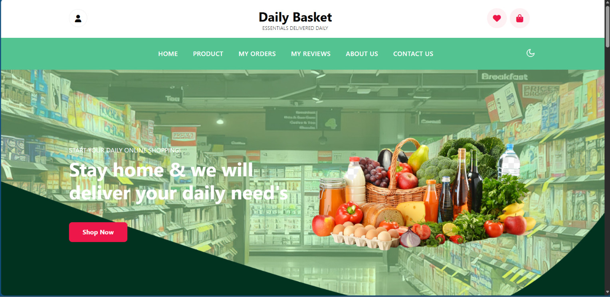
</p>

Displays featured grocery products, categories, latest offers, and navigation.

---

## 🛒 Product Listing

<p align="center">
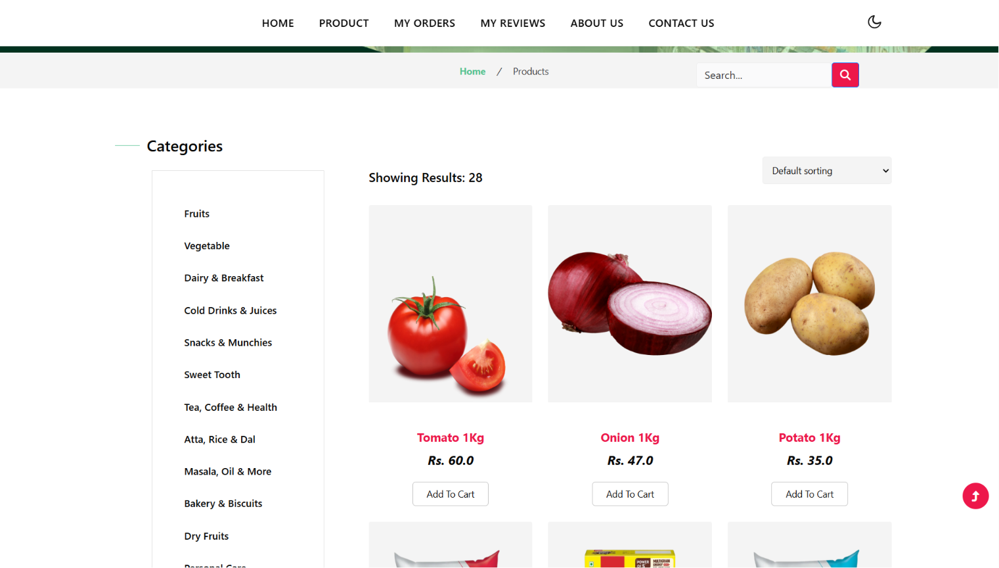
</p>

Browse products with category filters and search functionality.

---

## 📦 Product Details

<p align="center">
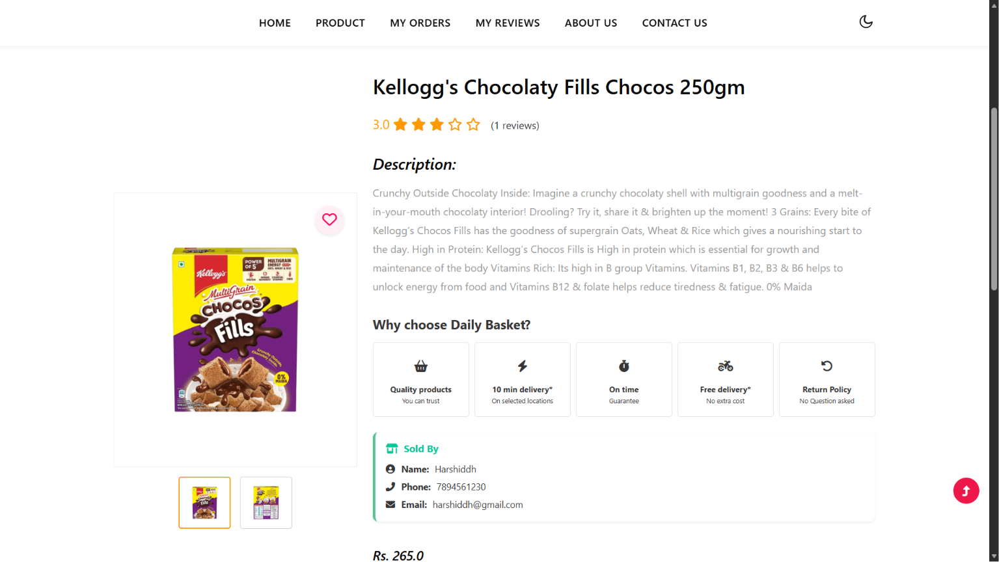
</p>

Shows complete product information, pricing, images, and purchase options.

---

## 🛍️ Shopping Cart

<p align="center">
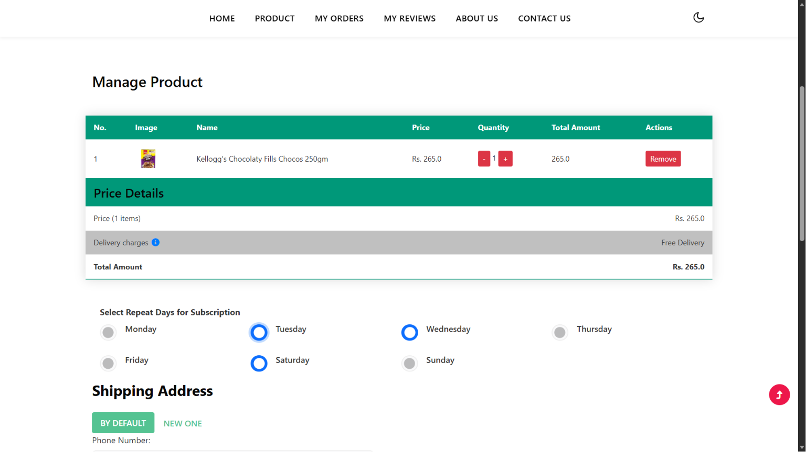
</p>

Allows users to review selected products before checkout.

---

## ❤️ Wishlist

<p align="center">
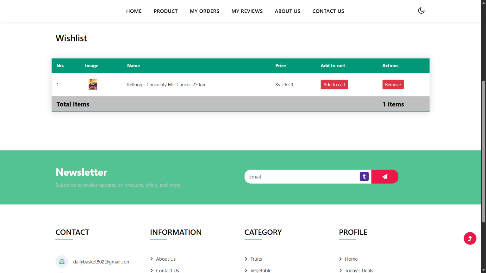
</p>

Users can save products for future purchases.

---

## 💳 Razorpay Checkout

<p align="center">
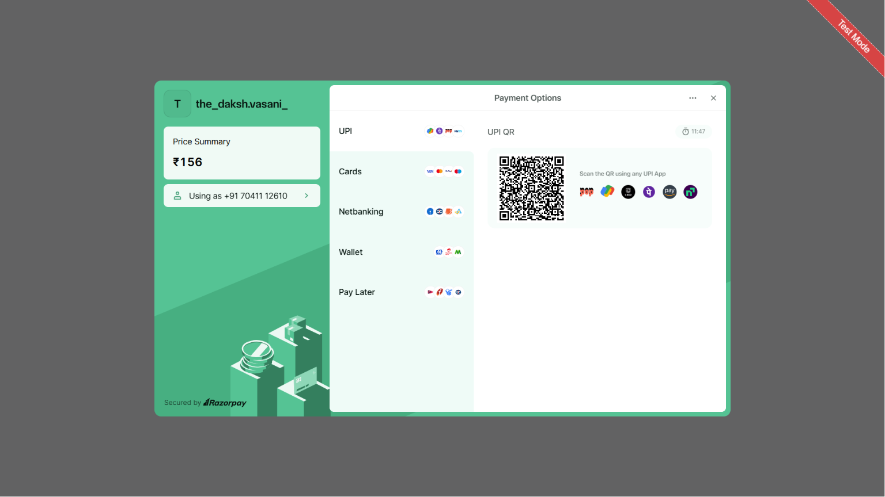
</p>

Secure online  powered by Razorpay.

---

## 📦 Order Management

<p align="center">
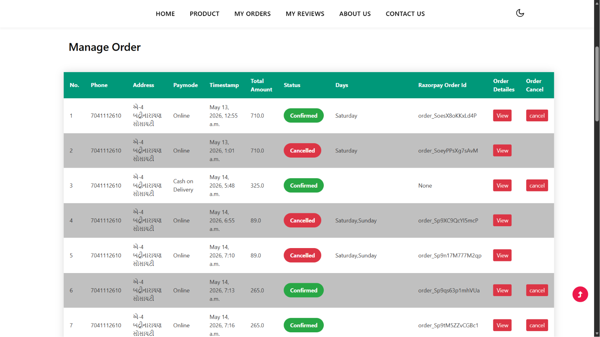
</p>

Displays customer order history and order status.

---

## 🛠️ Admin Dashboard

<p align="center">
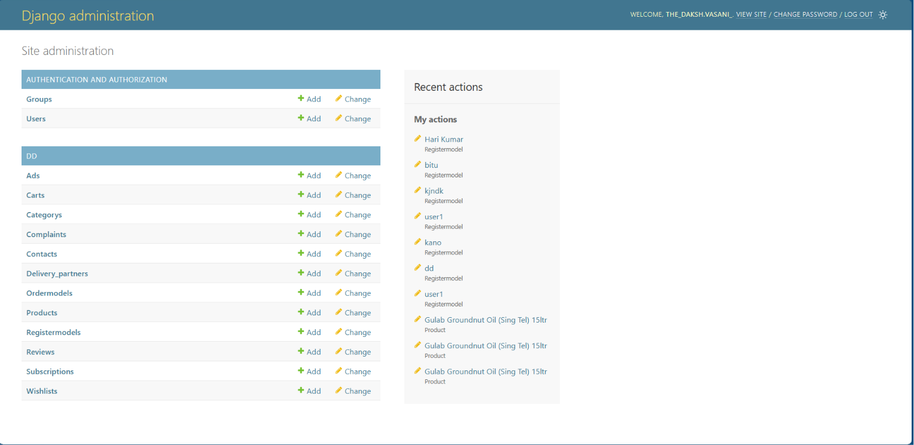
</p>

Provides complete control over products, orders, users, and categories.

---

# 🔄 Complete System Workflow

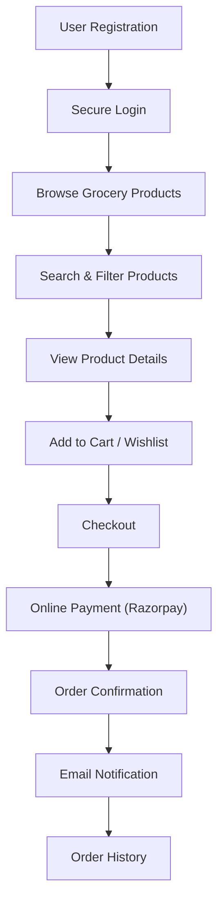

---

# 🏗️ System Architecture

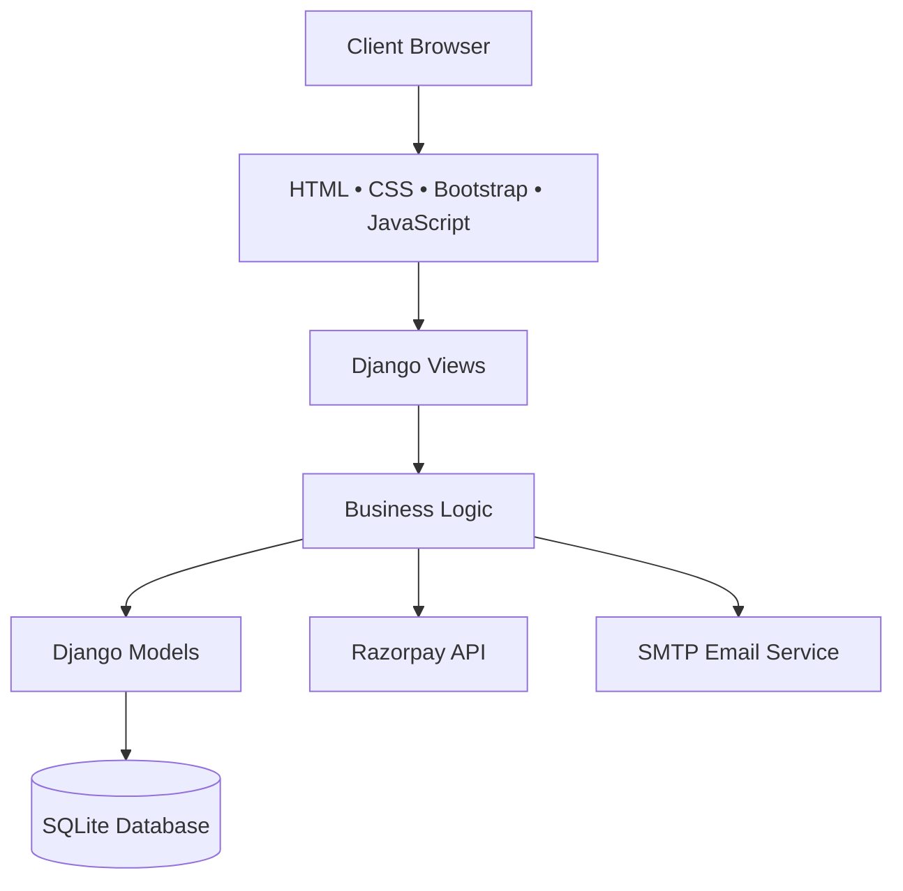
---

# 📂 Project Structure

```text
Grocery-Daily-Basket/

├── dd/
│   ├── migrations/
│   ├── templates/
│   ├── static/
│   ├── admin.py
│   ├── apps.py
│   ├── forms.py
│   ├── models.py
│   ├── urls.py
│   ├── views.py
│   └── ...
│
├── GroceryDailyBasket/
│   ├── settings.py
│   ├── urls.py
│   ├── wsgi.py
│   └── asgi.py
│
├── media/
├── static/
├── templates/
├── db.sqlite3
├── manage.py
├── requirements.txt
└── README.md
```

---
---

# 📄 Project Modules & File Explanation

Understanding the project structure is essential for maintaining and extending the application. Below is a detailed explanation of every important folder and file used in the Grocery Daily Basket project.

---

# 📂 Root Directory

```
Grocery-Daily-Basket/
```

This is the project's root directory that contains the Django application, configuration files, database, static resources, media files, and dependency files.

---

# 📂 manage.py

```
manage.py
```

The **manage.py** file is the command-line utility provided by Django.

### Responsibilities

- Starts the development server
- Creates database migrations
- Applies migrations
- Creates superuser accounts
- Opens Django shell
- Executes custom management commands

### Common Commands

Start Server

```bash
python manage.py runserver
```

Create Migrations

```bash
python manage.py makemigrations
```

Apply Migrations

```bash
python manage.py migrate
```

Create Admin

```bash
python manage.py createsuperuser
```

---

# 📂 GroceryDailyBasket/

This is the **main Django project configuration folder**.

```
GroceryDailyBasket/

├── settings.py
├── urls.py
├── asgi.py
├── wsgi.py
└── __init__.py
```

---

## ⚙ settings.py

The most important configuration file.

Responsible for:

- Installed Apps
- Database Configuration
- Static Files
- Media Files
- Templates
- Authentication
- Razorpay Keys
- SMTP Email Settings
- Security Settings
- Time Zone
- Language

This file controls the complete behavior of the Django project.

---

## 🌐 urls.py

Acts as the main URL router.

Responsibilities:

- Includes app URLs
- Admin URLs
- Authentication URLs
- Media URL configuration

Example

```
/
│
├── admin/
├── login/
├── products/
├── cart/
├── wishlist/
├── /
└── orders/
```

---

## 🚀 wsgi.py

Used when deploying the project using

- Gunicorn
- Apache
- Nginx

Provides communication between Django and production web servers.

---

## ⚡ asgi.py

Used for asynchronous deployments.

Supports

- WebSocket
- Async Views
- Django Channels

---

# 📂 dd/

The **dd** folder is the primary Django application that contains almost all business logic of the Grocery Daily Basket project.

```
dd/

├── admin.py
├── apps.py
├── forms.py
├── models.py
├── urls.py
├── views.py
├── migrations/
├── templates/
├── static/
└── __init__.py
```

---

# 🧩 admin.py

Registers database models with Django Admin.

Allows administrator to

- Add Products
- Edit Products
- Delete Products
- Manage Users
- Manage Orders
- Manage Categories

without writing SQL queries.

---

# 📦 apps.py

Defines application configuration.

Django automatically loads this application using Apps Configuration.

---

# 📄 models.py

One of the most important files.

Contains database schema.

Responsible for:

- Product Model
- Customer Model
- Category Model
- Cart Model
- Wishlist Model
- Order Model
-  Model

Each class inside models.py represents one database table.

---

# 📝 forms.py

Responsible for creating secure HTML forms.

Examples

- Login Form
- Registration Form
- Checkout Form
- Contact Form
- Product Forms

Benefits

- Validation
- Error Handling
- CSRF Protection

---

# 🌐 urls.py (Application)

Maps URLs to Views.

Example

```
Home
Products
Category
Cart
Wishlist
Checkout

Order
Profile
```

Keeps routing clean and organized.

---

# 👨‍💻 views.py

This is the heart of the project.

Contains all business logic.

Handles

- Login
- Logout
- Registration
- Product Display
- Product Details
- Cart Operations
- Wishlist Operations
- Checkout
- Razorpay 
- Email Sending
- Order Placement
- Search
- Profile

Every page that users see is controlled through this file.

---

# 📂 migrations/

Stores database migration files.

Migration files help Django

- Create Tables
- Modify Tables
- Add Columns
- Delete Columns

without manually writing SQL.

---

# 🎨 templates/

Contains HTML templates.

Example

```
templates/

base.html
home.html
login.html
register.html
cart.html
wishlist.html
checkout.html
.html
profile.html
orders.html
admin_dashboard.html
```

These files create the user interface of the application.

---

# 🎨 static/

Contains all frontend assets.

Includes

- CSS
- JavaScript
- Images
- Icons
- Fonts

Structure

```
static/

css/
js/
images/
icons/
fonts/
```

---

# 📁 media/

Stores uploaded files.

Examples

- Product Images
- Category Images
- User Profile Photos

Media files are generated dynamically during application usage.

---

# 🗄 db.sqlite3

SQLite database.

Stores

- Users
- Products
- Categories
- Orders
- Cart Items
- Wishlist
- s

No separate database installation is required.

---

# 📦 requirements.txt

Contains all required Python packages.

Example

```
Django
Pillow
razorpay
python-dotenv
requests
```

Install all packages

```bash
pip install -r requirements.txt
```

---

# 🔐 Authentication Module

Provides secure authentication using Django's built-in authentication system.

Features

- Registration
- Login
- Logout
- Session Management
- Password Encryption

---

# 🛒 Shopping Cart Module

Allows users to

- Add Product
- Remove Product
- Increase Quantity
- Decrease Quantity
- View Total Price

---

# ❤️ Wishlist Module

Users can

- Save Favorite Products
- Remove Products
- Move Products to Cart

---

# 💳 Razorpay  Workflow

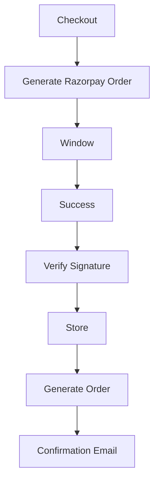

---

# 📧 Email Module

Automatically sends

- Registration Email
- Order Confirmation
- Payment Success
- Contact Messages

Uses SMTP configuration from Django Settings.

---

# 🔎 Product Search Module

Allows users to search products instantly.

Supports

- Product Name
- Category
- Keyword Search

---

# 👨‍💼 Admin Dashboard

Administrator can manage

- Products
- Categories
- Orders
- Customers
- Payments
- Inventory

through Django Admin Panel.

---

# 🔄 Overall Application Workflow

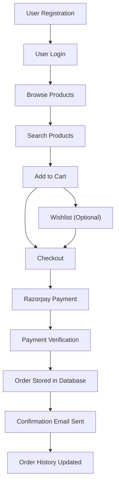


---

# ⚙️ Installation Guide

Follow the steps below to set up the Grocery Daily Basket project on your local machine.

---

# 📥 Clone Repository

Clone the repository from GitHub.

```bash
git clone https://github.com/VASANI007/Grocery-Daily-Basket.git
```

Move into the project directory.

```bash
cd Grocery-Daily-Basket
```

---

# 🐍 Create Virtual Environment

### Windows

```bash
python -m venv venv
```

Activate

```bash
venv\Scripts\activate
```

---

### Linux / macOS

```bash
python3 -m venv venv
```

Activate

```bash
source venv/bin/activate
```

---

# 📦 Install Dependencies

Install all required packages.

```bash
pip install -r requirements.txt
```

Verify installation

```bash
pip list
```

---

# 🗄 Database Setup

This project uses **SQLite** by default.

No additional database installation is required.

If you want to use MySQL or PostgreSQL, simply update the **DATABASES** section inside

```
settings.py
```

---

# 🔄 Apply Database Migrations

Generate migration files

```bash
python manage.py makemigrations
```

Apply migrations

```bash
python manage.py migrate
```

---

# 👤 Create Django Superuser

Create an administrator account.

```bash
python manage.py createsuperuser
```

Example

```text
Username : admin

Email : admin@example.com

Password : ********
```

Login using

```
http://127.0.0.1:8000/admin
```

---

# ▶️ Run Development Server

Start Django server

```bash
python manage.py runserver
```

Open browser

```
http://127.0.0.1:8000/
```

Admin Panel

```
http://127.0.0.1:8000/admin/
```

---

# 💳 Razorpay Payment Gateway Setup

This project supports secure online payments using **Razorpay**.

---

## Step 1

Create an account

https://razorpay.com/

---

## Step 2

Login into Razorpay Dashboard

Navigate to

```
Settings

↓

API Keys

↓

Generate Key
```

You'll receive

```
Key ID

Key Secret
```

---

## Step 3

Install Razorpay SDK

```bash
pip install razorpay
```

---

## Step 4

Open

```
settings.py
```

Add

```python
RAZORPAY_KEY_ID = "rzp_test_xxxxxxxxx"

RAZORPAY_KEY_SECRET = "xxxxxxxxxxxxxxxx"
```

---

## Step 5

Example

```python
import razorpay

client = razorpay.Client(
    auth=(
        settings.RAZORPAY_KEY_ID,
        settings.RAZORPAY_KEY_SECRET
    )
)
```

---

# 💳 Payment Flow

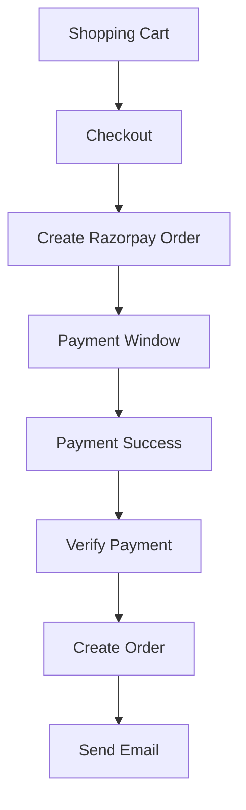

---

# 📧 Email Configuration (SMTP)

The project sends emails for

- Registration

- Order Confirmation

- Contact Messages

- Password Reset

---

## Enable Gmail App Password

Open

https://myaccount.google.com/security

Enable

```
2-Step Verification
```

Create

```
App Password
```

---

## Update settings.py

```python
EMAIL_BACKEND = "django.core.mail.backends.smtp.EmailBackend"

EMAIL_HOST = "smtp.gmail.com"

EMAIL_PORT = 587

EMAIL_USE_TLS = True

EMAIL_HOST_USER = "your_email@gmail.com"

EMAIL_HOST_PASSWORD = "your_app_password"

DEFAULT_FROM_EMAIL = EMAIL_HOST_USER
```

---

## Example Email

```python
from django.core.mail import send_mail

send_mail(
    "Order Confirmed",
    "Thank you for shopping with Grocery Daily Basket.",
    "your_email@gmail.com",
    ["customer@email.com"],
)
```

---

# 🔐 Using Environment Variables (.env)

Instead of storing secrets directly inside **settings.py**, create a `.env` file.

Example

```env
SECRET_KEY=your_secret_key

DEBUG=True

EMAIL_HOST_USER=your_email@gmail.com

EMAIL_HOST_PASSWORD=your_app_password

RAZORPAY_KEY_ID=rzp_test_xxxxxxxxx

RAZORPAY_KEY_SECRET=xxxxxxxxxxxxxxxx
```

Install

```bash
pip install python-dotenv
```

Load variables

```python
from dotenv import load_dotenv
import os

load_dotenv()

SECRET_KEY = os.getenv("SECRET_KEY")

RAZORPAY_KEY_ID = os.getenv("RAZORPAY_KEY_ID")

RAZORPAY_KEY_SECRET = os.getenv("RAZORPAY_KEY_SECRET")

EMAIL_HOST_USER = os.getenv("EMAIL_HOST_USER")

EMAIL_HOST_PASSWORD = os.getenv("EMAIL_HOST_PASSWORD")
```

---

# 📦 Required Python Packages

```
Django

Pillow

razorpay

python-dotenv

requests

gunicorn

whitenoise
```

Install manually

```bash
pip install Django Pillow razorpay python-dotenv requests gunicorn whitenoise
```

---

# 📸 Running Checklist

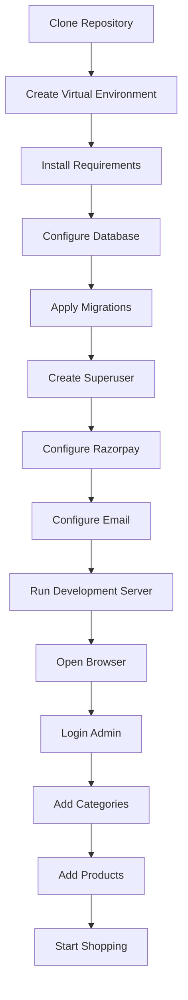

# 🚀 Deployment (Production)

Recommended platforms

- PythonAnywhere

- Render

- Railway

- Azure

- AWS EC2

- DigitalOcean

- VPS (Ubuntu)

For production remember to

- Set `DEBUG = False`

- Use environment variables

- Configure allowed hosts

- Collect static files

```bash
python manage.py collectstatic
```


---

# 🛒 User Guide

The Grocery Daily Basket platform is designed to provide a seamless online grocery shopping experience. Users can browse products, add them to their shopping cart or wishlist, securely complete payments, and manage their orders through a simple and intuitive interface.

---

# 👤 Customer Workflow

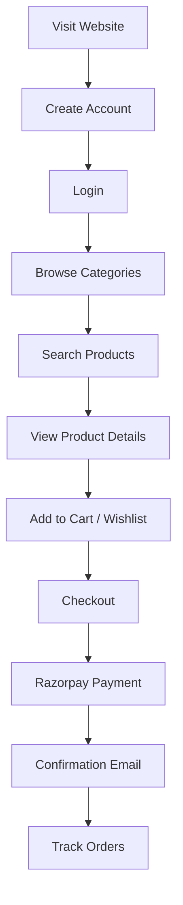

---

# 🛍️ Shopping Experience

### Browse Products

Customers can:

- View all available grocery items
- Browse by category
- View product images
- Check pricing
- Read product descriptions

---

### Search Products

The search system allows users to quickly find products using:

- Product Name
- Category
- Keywords

---

### Shopping Cart

Users can

- Add Products
- Remove Products
- Update Quantity
- View Total Amount
- Continue Shopping
- Proceed to Checkout

---

### Wishlist

Wishlist allows users to

- Save favorite products
- Move items to cart later
- Remove unwanted items

---

### Checkout

Checkout page displays

- Delivery Information
- Order Summary
- Total Price
- Payment Method

---

# 💳 Payment Workflow

Payments are securely processed using **Razorpay**.


Supported payment methods include:

- Credit Card
- Debit Card
- UPI
- Net Banking
- Wallets

---

# 📧 Email Notification Workflow

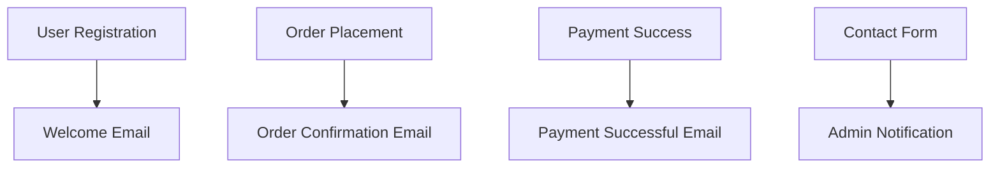

# 👨‍💼 Administrator Workflow

The Django Admin Dashboard enables administrators to efficiently manage every aspect of the store.

---

## Product Management

Administrator can

- Add Products
- Edit Products
- Delete Products
- Upload Product Images
- Update Prices
- Manage Stock

---

## Category Management

Administrator can

- Add Categories
- Edit Categories
- Remove Categories

---

## Customer Management

Administrator can

- View Registered Users
- Manage Customer Accounts
- Monitor User Activity

---

## Order Management

Administrator can

- View Orders
- Update Order Status
- Cancel Orders
- Track Payments

---

## Payment Management

Administrator can

- View Razorpay Transactions
- Verify Payments
- Monitor Failed Transactions

---

# 🔒 Security Features

This project includes several security mechanisms provided by Django.

- CSRF Protection
- Password Hashing
- Session Authentication
- SQL Injection Protection
- Form Validation
- Authentication Middleware
- Secure Payment Integration

---

# 📈 Future Improvements

The following features can be added in future versions.

### Customer Features

- Product Reviews
- Product Ratings
- Discount Coupons
- Referral Program
- Loyalty Points
- Live Chat Support
- Multi-language Support
- Dark Mode

---

### Admin Features

- Sales Dashboard
- Analytics Reports
- Inventory Forecasting
- Customer Insights
- Bulk Product Upload
- Invoice Generation

---

### Technical Improvements

- PostgreSQL Database
- Redis Cache
- Docker Support
- REST API
- JWT Authentication
- Mobile Application
- AI Product Recommendation
- Cloud Deployment

---

# 📚 Learning Outcomes

This project demonstrates practical implementation of

- Python Programming
- Django Framework
- MVC (MVT) Architecture
- Database Management
- Authentication
- Payment Gateway Integration
- Email Services
- CRUD Operations
- Frontend Development
- Full Stack Web Development

---

# 🎓 Suitable For

This project is useful for

- BCA Final Year Projects
- MCA Major Projects
- B.Tech Projects
- Django Learning
- Python Portfolio
- Full Stack Development Practice

---

# 📖 References

### Official Documentation

Django

https://docs.djangoproject.com/

---

Razorpay

https://razorpay.com/docs/

---

Python

https://docs.python.org/3/

---

Bootstrap

https://getbootstrap.com/

---

SQLite

https://www.sqlite.org/

---

HTML

https://developer.mozilla.org/

---

CSS

https://developer.mozilla.org/

---

JavaScript

https://developer.mozilla.org/

---

Git

https://git-scm.com/

---

GitHub

https://docs.github.com/

---

# 📄 License

This project is licensed under the **MIT License**.

You are free to

- Use
- Modify
- Distribute
- Learn

while providing proper credit to the original author.

---


---

# ❓ Frequently Asked Questions (FAQ)

### 1. Which Python version should I use?

Python **3.10+** is recommended.

---

### 2. Which Django version is compatible?

The project works best with the latest stable Django version listed in **requirements.txt**.

---

### 3. Which database is used?

By default:

```
SQLite
```

You can easily migrate to:

- MySQL
- PostgreSQL
- MariaDB

by updating the `DATABASES` configuration inside `settings.py`.

---

### 4. Does the project support online payment?

✅ Yes.

The application integrates with **Razorpay Payment Gateway**, allowing users to securely pay using:

- UPI
- Debit Card
- Credit Card
- Net Banking
- Wallets

---

### 5. Does the project send emails?

Yes.

Automatic emails are sent for:

- Registration
- Order Confirmation
- Payment Confirmation
- Password Reset (if enabled)
- Contact Form

---

### 6. Is Admin Panel Included?

Yes.

Django Admin Panel allows management of:

- Products
- Categories
- Customers
- Orders
- Payments
- Inventory

---

### 7. Can I deploy this project?

Absolutely.

Supported platforms:

- Render
- Railway
- PythonAnywhere
- AWS EC2
- Azure
- DigitalOcean
- VPS (Ubuntu)
- Docker

---

# 💻 Technologies Used

## Backend

- Python
- Django

---

## Frontend

- HTML5
- CSS3
- Bootstrap
- JavaScript

---

## Database

- SQLite

---

## APIs

- Razorpay Payment Gateway
- SMTP Email Service

---

## Tools

- Git
- GitHub
- VS Code

---

# 📊 Project Statistics

| Feature | Status |
|----------|---------|
| Authentication | ✅ |
| Product Management | ✅ |
| Category Management | ✅ |
| Shopping Cart | ✅ |
| Wishlist | ✅ |
| Checkout | ✅ |
| Razorpay Payment | ✅ |
| Email Notification | ✅ |
| Admin Dashboard | ✅ |
| Responsive UI | ✅ |
| Search System | ✅ |

---

# 🎯 Real World Applications

This project can be used for

- Grocery Store
- Supermarket
- Organic Food Shop
- Vegetable Store
- Fruit Shop
- Dairy Products
- Pharmacy Store
- Bakery
- Local Delivery Business

---

# 📈 Project Advantages

✔ Clean Django Architecture

✔ Secure Authentication

✔ Easy Customization

✔ Responsive Design

✔ Online Payment

✔ Email Integration

✔ Scalable Structure

✔ Beginner Friendly

✔ Production Ready

✔ Easy Deployment

---

# 🏗️ Database Tables

The project primarily manages data for:

```
Users
│
├── Customers
├── Products
├── Categories
├── Cart
├── Wishlist
├── Orders
├── Payments
└── Contact Messages
```

---

# 🔄 Complete Application Flow

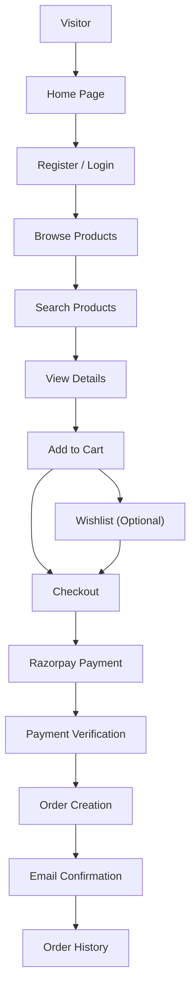

# 📂 Recommended Folder Organization

```text
Grocery-Daily-Basket/

├── GroceryDailyBasket/
├── dd/
├── static/
├── templates/
├── media/
├── screenshots/
│
├── requirements.txt
├── manage.py
├── README.md
├── LICENSE
├── .gitignore
└── .env.example
```

---

# 🌟 Why This Project?

This project demonstrates practical knowledge of:

- Full Stack Web Development
- Django Framework
- Python Programming
- Database Design
- Payment Gateway Integration
- Authentication & Authorization
- CRUD Operations
- MVC (MVT) Architecture
- Responsive UI Design
- Email Automation

It is suitable for:

- Academic Major Projects
- Portfolio Projects
- Internship Demonstrations
- Placement Interviews
- Freelancing
- Small Business Solutions

---

# 🤝 Contribution

Contributions are welcome!

If you'd like to improve this project:

1. Fork the repository
2. Create a new feature branch

```bash
git checkout -b feature/NewFeature
```

3. Commit your changes

```bash
git commit -m "Add New Feature"
```

4. Push the branch

```bash
git push origin feature/NewFeature
```

5. Open a Pull Request

---

# 🐞 Reporting Issues

Found a bug or have a feature request?

Please open an issue on GitHub with:

- Clear description
- Steps to reproduce
- Expected behavior
- Screenshots (if applicable)

---

# 📬 Contact

**Daksh Vasani**

📧 Email: dakshvasani2510@gmail.com

💼 LinkedIn: https://linkedin.com/in/daksh-vasani-553b13307

💻 GitHub: https://github.com/VASANI007

---


# 👨‍💻 Author

## Daksh Vasani

**Aspiring Data Scientist | Python Developer | Django Developer | Machine Learning Enthusiast**

### Connect with me

GitHub

https://github.com/VASANI007

LinkedIn

https://linkedin.com/in/daksh-vasani-553b13307

Email

dakshvasani2510@gmail.com

---

# ⭐ Support

If you found this project useful, consider supporting it by

⭐ Starring the repository

🍴 Forking the project

🛠️ Contributing improvements

📢 Sharing it with others

Your support motivates future development and helps the project reach more developers.

---

# 🙏 Acknowledgements

Special thanks to the open-source community and the developers of

- Django
- Python
- Bootstrap
- Razorpay
- SQLite

for providing the excellent tools and libraries that made this project possible.

---

<p align="center">

</p>
